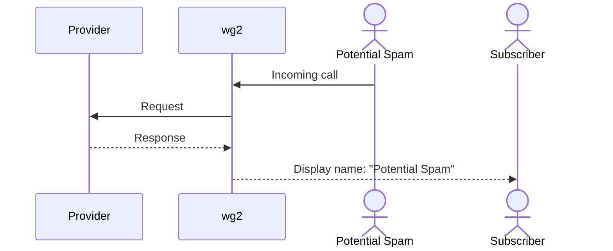
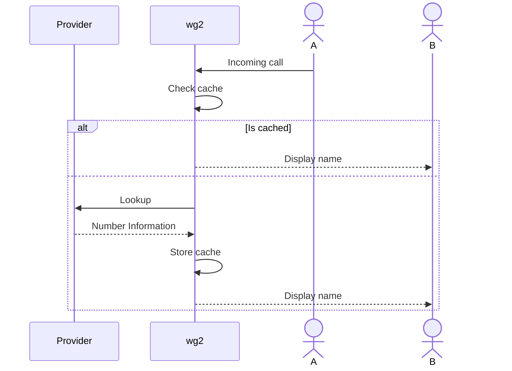
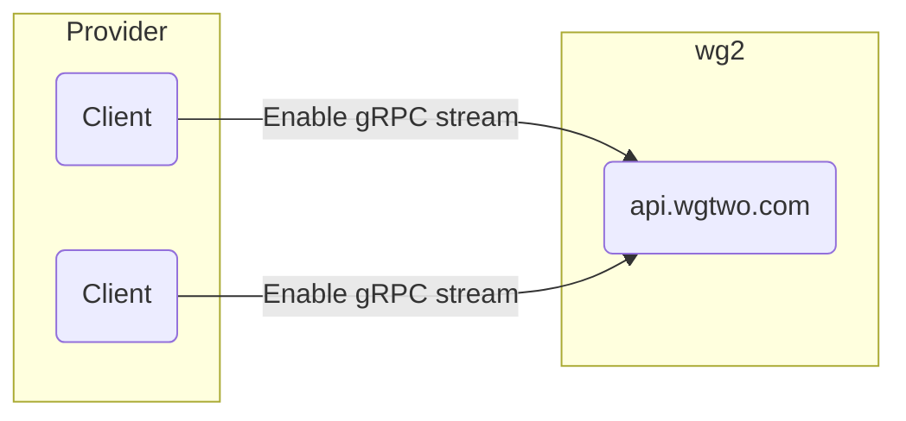

# Sequence Overview

```mermaid
sequenceDiagram
    participant Provider
    participant wg2
    actor Potential Spam
    actor Subscriber

    Potential Spam->>wg2: Incoming call
    wg2->>Provider: Request
    Provider-->>wg2: Response
    wg2-->>Subscriber: Display name: "Potential Spam"
```

# Sequence

```mermaid
sequenceDiagram
    participant Provider
    participant wg2
    actor A
    actor B

    A->>wg2: Incoming call
    wg2->>wg2: Check cache
    alt Is cached
        wg2-->>B: Display name
    else
        wg2->>Provider: Lookup
        Provider-->>wg2: Number Information
        wg2->>wg2: Store cache
        wg2-->>B: Display name
    end
```

# Flow

```mermaid
flowchart LR
  subgraph wg2
    C(api.wgtwo.com)
  end
  subgraph Provider
    A(Client)
    B(Client)
  end
    A -->|Enable gRPC stream| C
    B -->|Enable gRPC stream| C
```
